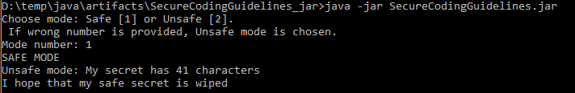
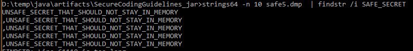
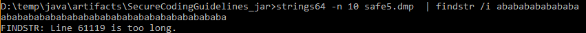

# CONFIDENTIAL-3: Consider purging highly sensitive from memory after use


To narrow the window when highly sensitive information may appear in core dumps, debugging, and confidentiality attacks, it may be appropriate to zero memory containing the data immediately after use rather than waiting for the garbage collection mechanism.

However, doing so does have negative consequences. Code quality will be compromised with extra complications and mutable data structures. Libraries may make copies, leaving the data in memory anyway. The operation of the virtual machine and operating system may leave copies of the data in memory or even on disk.


## Example 1: Difference between a String and an Array of Characters


### Mutable vs Immutable Objects

__immutable objects__ have no fields that can be changed after the object is created. For examples: `String` and `char`.    

__Mutable objects__ have fields that can be changed. For examples: an array of `char` ( `char[]` ). 

A `String` object is immutable, that is, its contents never change, while an array of characters ( `char[]` ) has mutable elements. 
[\[Source\]](https://docs.oracle.com/javase/specs/jls/se7/html/jls-10.html). The characters contained in the `char[]` are immutable, but the array itself is mutable.   

Other things that will influence the memory is `Garbage Collection` and the `String Pool`.   

### Code

__Function `clearSafeSecret`:__   
After usage of the function `safe()`, the information of the mutable `char[]` is overwritten with new random immutable characters.   

__Function `clearUnsafeSecret`:__   
After usage of the function `unsafe()`, I set the pointer of object `myUnsafeSecret` to `null`. After this happens I run the `Garbage Collection`. This can still fail because of the `String Pool`.   

### Proof Of Concept
__Run the Java class:__   
   

__Searching for the string `SAFE_SECRET`:__   
   
The string `SAFE_SECRET_THAT_SHOULD_NOT_STAY_IN_MEMORY` is not found in memory, but the string `UNSAFE_SECRET_THAT_SHOULD_NOT_STAY_IN_MEMORY` is found.   

__Searching for the string `abababababa...`:__   
   
The string `abababababa...` is found in memory.   

### Do It Yourself
>I use `procdump64` and `strings64` form [Sysinternals](https://docs.microsoft.com/en-us/sysinternals/) to create the memory dump and get the strings out of the memory dump.   

1. Run the Java Class from commandline   

2. Create a memory dump   
```   
procdump64 -ma PID_of_the_process
```   

3. Search for strings in the memory dump   
```
strings64 -n MEMORYDUMP.dmp | findstr /i SAFE_SECRET_THAT
```

### Todo
- Create a better example with user input   
- Explain the concept better   


Ben and I are in the process of fine tuning this example.